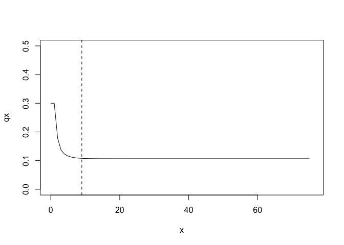

<!-- README.md is generated from README.Rmd. Please edit that file -->
Rage
====

[](https://travis-ci.org/jonesor/Rage) [](https://ci.appveyor.com/project/jonesor/Rage) [](https://codecov.io/github/jonesor/Rage?branch=devel)

An R package for analyzing matrix population models (MPMs). Includes functions for deriving life history traits (life expectancy, net reproductive rate, shape of mortality trajectory, etc.), age-from-stage analyses (deriving life tables or life table components), vital rate summaries, perturbation analyses (sensitivities and elasticities, including stochastic elasticities), and general MPM manipulation. Note this package is at an early stage of development, and may contain bugs.

Installation
------------

Install from GitHub with:

``` r
# install.packages("remotes")
remotes::install_github("jonesor/Rage")
```

Usage
-----

``` r
library(Rage)
```

#### Preliminaries: create a matrix population model (MPM)

The functions in Rage work on MPMs (or their components), so we'll start by creating an MPM that's separated into a growth/survival component (`matU`) and a sexual reproduction component (`matF`). We could also include a clonal component (`matC`), but we'll skip that here.

``` r
# growth/survival component
matU <- rbind(c(0.1,   0,   0,   0),
              c(0.6, 0.2, 0.1,   0),
              c(  0, 0.5, 0.5, 0.1),
              c(  0,   0, 0.3, 0.8))

# sexual reproduction component
matF <- rbind(c(  0,   0, 0.2, 0.6),
              c(  0,   0, 0.1, 0.2),
              c(  0,   0,   0,   0),
              c(  0,   0,   0,   0))
```

#### Derive life history traits from an MPM

``` r
life_expect(matU)           # life expectancy
>> [1] 5.749
longevity(matU)             # longevity
>> [1] 36
net_repro_rate(matU, matF)  # net reproductive rate
>> [1] 2.464
mature_age(matU, matF)      # mean age at first reproduction
>> [1] 3.361
mature_prob(matU, matF)     # probability of surviving to reproductive maturity
>> [1] 0.4167
```

Some life history traits are calculated from a life table rather than an MPM, in which case we can use the `mpm_to_` group of functions to derive the necessary life table components.

``` r
# first derive age-trajectories of survivorship (lx) and fecundity (mx)
lx <- mpm_to_lx(matU)
mx <- mpm_to_mx(matU, matF)

# then calculate life history traits
entropy_k(lx)       # Keyfitz' entropy
>> [1] 1.279
entropy_d(lx, mx)   # Demetrius' entropy
>> [1] 2.371
shape_surv(lx)      # shape of survival/mortality trajectory
>> [1] -0.03364
shape_rep(lx)       # shape of fecundity trajectory
>> [1] 0.3981
```

#### Life tables and the quasi-stationary distribution

Some MPMs are parameterized with a stasis loop at the maximum stage class, which can lead to apparent plateaus in mortality or fertility trajectories derived using age-from-stage methods. The function `qsd_converge` can be used to identify the time it takes for a cohort to reach the quasi-stationary distribution (QSD). This quantity can then be used to subset age trajectories of mortality or fertility to periods earlier than the QSD, so as to avoid artefactual plateaus in mortality or fertility.

``` r
# derive life table from MPM
lt <- mpm_to_table(matU)

# calculate time to QSD
(q <- qsd_converge(matU))
>> [1] 9

# plot mortality trajectory w/ vertical line at time to QSD
plot(qx ~ x, data = lt, type = "l", ylim = c(0, 0.5))
abline(v = q, lty = 2)
```



From the life table derived from `matU`, we can see a plateau in the mortality rate (qx) beginning around age 10. Given that the QSD is reached at 9 time steps, this plateau is an artefact of the stasis loop, and therefore not necessarily a biological reality for population represented by `matU`.

One approach to accounting for this artefactual plateau in subsequent life history calculations is to limit our life table to the period prior to the QSD.

``` r
# calculate the shape of the survival/mortality trajectory
shape_surv(lt$lx)       # full lx trajectory
>> [1] -0.03364
shape_surv(lt$lx[1:q])  # lx trajectory prior to the QSD
>> [1] -0.1255
```

#### Standardized vital rates

The transition rates that make up MPMs often reflect products of two or more vital rates. For instance a 'growth' transition from one stage class to the next may be a product of two vital rates: survival, and growth conditional on survival. The `vr_` group of functions are used to derive vital rates from an MPM. The vital rates may be averaged across the entire MPM (`vr_` functions), or averaged within stage classes (`vr_vec_` functions).

``` r
# MPM-averaged vital rates (scalar)
vr_survival(matU)
>> [1] 0.8
vr_growth(matU)
>> [1] 0.6349
vr_shrinkage(matU)
>> [1] 0.1111
vr_fecundity(matU, matF)
>> [1] 0.6111

# stage-averaged vital rates (vector)
vr_vec_survival(matU)
>> [1] 0.7 0.7 0.9 0.9
vr_vec_growth(matU)
>> [1] 0.8571 0.7143 0.3333     NA
vr_vec_shrinkage(matU)
>> [1]     NA     NA 0.1111 0.1111
vr_vec_fecundity(matU, matF)
>> [1]     NA     NA 0.3333 0.8889
```

#### Perturbation analyses

The `perturb_matrix` function measures the response of a demographic statistic to perturbation of individual matrix elements (i.e. sensitivities and elasticities). The `perturb_vr` and `perturb_trans` functions implement perturbation analyses by vital rate type (survival, growth, etc.) and transition type (stasis, retrogression, etc.), respectively.

``` r
# matrix element perturbation
perturb_matrix(matU + matF, type = "sensitivity")
>>        [,1]   [,2]   [,3]   [,4]
>> [1,] 0.0841 0.1029 0.1038 0.1051
>> [2,] 0.1397 0.1709 0.1725 0.1745
>> [3,] 0.2504 0.3064 0.3093 0.3129
>> [4,] 0.3488 0.4267 0.4307 0.4358

# vital rate perturbation
# (we use as.data.frame here for prettier printing)
as.data.frame(perturb_vr(matU, matF, type = "sensitivity"))
>>   survival growth shrinkage fecundity clonality
>> 1    1.307 0.2431   -0.2337    0.5003         0

# transition type perturbation
as.data.frame(perturb_trans(matU, matF, type = "sensitivity"))
>>   stasis  retro  progr fecundity clonality
>> 1      1 0.4853 0.8768    0.5559        NA
```

List of functions
-----------------

<table style="width:99%;">
<colgroup>
<col width="23%" />
<col width="20%" />
<col width="54%" />
</colgroup>
<thead>
<tr class="header">
<th>Category</th>
<th>Function</th>
<th>Description</th>
</tr>
</thead>
<tbody>
<tr class="odd">
<td>Life table</td>
<td><code>mpm_to_table</code></td>
<td>MPM to life table</td>
</tr>
<tr class="even">
<td></td>
<td><code>mpm_to_lx</code></td>
<td>MPM to survivorship trajectory</td>
</tr>
<tr class="odd">
<td></td>
<td><code>mpm_to_px</code></td>
<td>MPM to survival trajectory</td>
</tr>
<tr class="even">
<td></td>
<td><code>mpm_to_hx</code></td>
<td>MPM to mortality hazard trajectory</td>
</tr>
<tr class="odd">
<td></td>
<td><code>mpm_to_mx</code></td>
<td>MPM to fecundity trajectory</td>
</tr>
<tr class="even">
<td></td>
<td><code>lx_to_[px/hx]</code></td>
<td>Convert from survivorship trajectory</td>
</tr>
<tr class="odd">
<td></td>
<td><code>px_to_[lx/hx]</code></td>
<td>Convert from survival trajectory</td>
</tr>
<tr class="even">
<td></td>
<td><code>hx_to_[lx/px]</code></td>
<td>Convert from mortality hazard trajectory</td>
</tr>
<tr class="odd">
<td></td>
<td><code>qsd_converge</code></td>
<td>Time to quasi-stationary destribution</td>
</tr>
<tr class="even">
<td>Life history traits</td>
<td><code>life_expect</code></td>
<td>Life expectancy</td>
</tr>
<tr class="odd">
<td></td>
<td><code>longevity</code></td>
<td>Longevity</td>
</tr>
<tr class="even">
<td></td>
<td><code>net_repro_rate</code></td>
<td>Net reproductive rate</td>
</tr>
<tr class="odd">
<td></td>
<td><code>gen_time</code></td>
<td>Generation time</td>
</tr>
<tr class="even">
<td></td>
<td><code>mature_age</code></td>
<td>Age at reproductive maturity</td>
</tr>
<tr class="odd">
<td></td>
<td><code>mature_prob</code></td>
<td>Probability of reaching reproductive maturity</td>
</tr>
<tr class="even">
<td></td>
<td><code>mature_life_expect</code></td>
<td>Remaining life expectancy at maturity</td>
</tr>
<tr class="odd">
<td></td>
<td><code>entropy_d</code></td>
<td>Demetrius' entropy</td>
</tr>
<tr class="even">
<td></td>
<td><code>entropy_k</code></td>
<td>Keyfitz' entropy</td>
</tr>
<tr class="odd">
<td></td>
<td><code>shape_surv</code></td>
<td>Shape of survival/mortality trajectory</td>
</tr>
<tr class="even">
<td></td>
<td><code>shape_rep</code></td>
<td>Shape of fecundity trajectory</td>
</tr>
<tr class="odd">
<td>Vital rates</td>
<td><code>vr_[...]</code></td>
<td>MPM-averaged vital rates</td>
</tr>
<tr class="even">
<td></td>
<td><code>vr_vec_[...]</code></td>
<td>Stage-averaged vital rates</td>
</tr>
<tr class="odd">
<td></td>
<td><code>vr_mat_[...]</code></td>
<td>Survival-independent vital rates</td>
</tr>
<tr class="even">
<td>Perturbation</td>
<td><code>perturb_matrix</code></td>
<td>Perturbation analysis of whole matrix</td>
</tr>
<tr class="odd">
<td></td>
<td><code>perturb_trans</code></td>
<td>Perturbation analysis of transition types</td>
</tr>
<tr class="even">
<td></td>
<td><code>perturb_vitals</code></td>
<td>Perturbation analysis of vital rate types</td>
</tr>
<tr class="odd">
<td></td>
<td><code>perturb_stochastic</code></td>
<td>Stochastic perturbation analysis</td>
</tr>
<tr class="even">
<td>MPM transformation</td>
<td><code>mpm_split</code></td>
<td>Split MPM into survival and reproductive components</td>
</tr>
<tr class="odd">
<td></td>
<td><code>mpm_rearrange</code></td>
<td>Rearrange MPM to segregate reproductive stages</td>
</tr>
<tr class="even">
<td></td>
<td><code>mpm_collapse</code></td>
<td>Collapse MPM to smaller number of stages</td>
</tr>
<tr class="odd">
<td></td>
<td><code>mpm_standardize</code></td>
<td>Collapse MPM to standardized set of stages</td>
</tr>
<tr class="even">
<td></td>
<td><code>standard_stages</code></td>
<td>Group stages into standardized sets</td>
</tr>
<tr class="odd">
<td></td>
<td><code>id_repro_stages</code></td>
<td>Identify reproductive stages</td>
</tr>
<tr class="even">
<td></td>
<td><code>plot_life_cycle</code></td>
<td>Plot a life cycle diagram</td>
</tr>
</tbody>
</table>

Contributions
-------------

All contributions are welcome. Please note that this project is released with a [Contributor Code of Conduct](CODE_OF_CONDUCT.md). By participating in this project you agree to abide by its terms.
