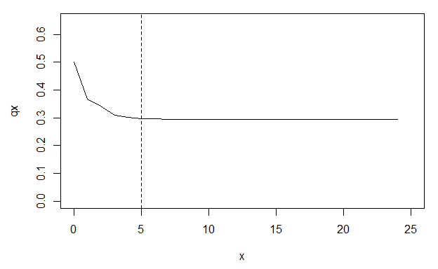

<!-- README.md is generated from README.Rmd. Please edit that file -->
Rage
====

[](https://travis-ci.org/jonesor/Rage) [](https://ci.appveyor.com/project/jonesor/Rage) [](https://codecov.io/github/jonesor/Rage?branch=devel)

An R package for manipulating and analyzing matrix population models (MPMs). Includes functions for:

-   deriving life history traits
-   deriving life tables or life table components
-   deriving vital rates
-   perturbation analyses
-   manipulating and transforming MPMs

Installation
------------

Install from GitHub with:

``` r
# install.packages("remotes")
remotes::install_github("jonesor/Rage")
```

### Usage

``` r
library(Rage)
```

### Loading an example MPM

The functions in Rage work on MPMs (or components of MPMs), so we'll start by loading one of the example MPMs included in the Rage package (`mpm1`).

``` r
library(Rage)  # load Rage
data(mpm1)     # load data object 'mpm1'

mpm1
#> $matU
#>         seed small medium large dormant
#> seed    0.10  0.00   0.00  0.00    0.00
#> small   0.05  0.12   0.10  0.00    0.00
#> medium  0.00  0.35   0.12  0.23    0.12
#> large   0.00  0.00   0.28  0.52    0.10
#> dormant 0.00  0.00   0.16  0.11    0.17
#> 
#> $matF
#>         seed small medium large dormant
#> seed       0     0   17.9  45.6       0
#> small      0     0    0.0   0.0       0
#> medium     0     0    0.0   0.0       0
#> large      0     0    0.0   0.0       0
#> dormant    0     0    0.0   0.0       0
```

The object `mpm1` is a list containing two elements: the growth/survival component of the MPM (the **U** matrix), and the sexual reproduction component (the **F** matrix). We can obtain the full MPM by adding the two components together (**A** = **U** + **F**).

### Deriving life history traits from an MPM

One of the most common arguments among functions in Rage is `start`, which is used to specify the stage class that represents the 'beginning of life' for the purposes of calculation. Because the first stage class in `mpm1` is a 'seed' stage, which we might consider functionally-distinct from the 'above-ground' stages, we'll specify `start = 2` to set our starting stage class of interest to the 'small' stage.

``` r
life_expect(mpm1$matU, start = 2)               # life expectancy
#> [1] 2.362
longevity(mpm1$matU, start = 2, lx_crit = 0.05) # longevity (age at lx = 0.05)
#> [1] 7
mature_age(mpm1$matU, mpm1$matF, start = 2)     # mean age at first reproduction
#> [1] 2.136
mature_prob(mpm1$matU, mpm1$matF, start = 2)    # prob survival to first repro
#> [1] 0.3977
```

Some life history traits are independent of the starting stage class, in which case we don't need to specify `start`.

``` r
net_repro_rate(mpm1$matU, mpm1$matF)    # net reproductive rate
#> [1] 1.58
gen_time(mpm1$matU, mpm1$matF)          # generation time
#> [1] 5.522
```

Other life history traits are calculated from a life table rather than an MPM, in which case we can first use the `mpm_to_` group of functions to derive the necessary life table components.

``` r
# first derive age-trajectories of survivorship (lx) and fecundity (mx)
lx <- mpm_to_lx(mpm1$matU, start = 2)
mx <- mpm_to_mx(mpm1$matU, mpm1$matF, start = 2)

# then calculate life history traits
entropy_k(lx)       # Keyfitz' entropy
#> [1] 0.9508
entropy_d(lx, mx)   # Demetrius' entropy
#> [1] -1.787
shape_surv(lx)      # shape of survival/mortality trajectory
#> [1] -0.03222
shape_rep(lx)       # shape of fecundity trajectory
#> [1] 0.4078
```

### Life tables and the quasi-stationary distribution

Some MPMs are parameterized with a stasis loop at the maximum stage class, which can lead to apparent plateaus in mortality or fertility trajectories derived using age-from-stage methods. The function `qsd_converge()` can be used to identify the time it takes for a cohort to reach the quasi-stationary distribution (QSD). This quantity can then be used to subset age trajectories of mortality or fertility to periods earlier than the QSD, so as to avoid artefactual plateaus in mortality or fertility.

``` r
# derive life table from MPM
lt <- mpm_to_table(mpm1$matU, start = 2)

# calculate time to QSD
(q <- qsd_converge(mpm1$matU, start = 2))
#> [1] 5

# plot mortality trajectory w/ vertical line at time to QSD
par(mar = c(4.5, 4.5, 1, 1))
plot(qx ~ x, data = lt, type = "l", ylim = c(0, 0.65))
abline(v = q, lty = 2)
```



From the life table derived from `mpm1`, we can see a plateau in the mortality rate (qx) beginning around age 5. However, this plateau corresponds to the QSD and is therefore probably an artefact of the stasis loop rather than a biological reality for the population represented by `mpm1`.

One approach to accounting for this artefactual plateau in subsequent life history calculations is to limit our life table to the period prior to the QSD.

``` r
# calculate the shape of the survival/mortality trajectory
shape_surv(lt$lx)       # based on full lx trajectory
#> [1] -0.03222
shape_surv(lt$lx[1:q])  # based on lx trajectory prior to the QSD
#> [1] -0.07063
```

### Standardized vital rates

The transition rates that make up MPMs generally reflect products of two or more vital rates (sometimes called ‘lower-level vital rates’). Assuming a post-breeding census design, we can retroactively break apart each transition rate into at least two vital rate components: survival, and ‘something’ conditional on survival. That ‘something’ might be growth, shrinkage, stasis, dormancy, fecundity, or clonality.

##### Stage-specific vital rates (vector)

To summarize vital rates *within* stage classes, we can use the `vr_vec_` group of functions. We'll use the `exclude` argument here to exclude certain stage classes ('seed' and 'dormant') from the calculation of certain vital rates (e.g. we don't consider the large-to-dormant transition to actually represent 'growth').

``` r
vr_vec_survival(mpm1$matU)
#>    seed   small  medium   large dormant 
#>    0.15    0.47    0.66    0.86    0.39
vr_vec_growth(mpm1$matU, exclude = c(1, 5))
#>    seed   small  medium   large dormant 
#>      NA  0.7447  0.4242      NA      NA
vr_vec_shrinkage(mpm1$matU, exclude = 5)
#>    seed   small  medium   large dormant 
#>      NA      NA  0.1515  0.2674      NA
vr_vec_stasis(mpm1$matU)
#>    seed   small  medium   large dormant 
#>  0.6667  0.2553  0.1818  0.6047  0.4359
vr_vec_dorm_enter(mpm1$matU, dorm_stages = 5)
#>    seed   small  medium   large dormant 
#>      NA      NA  0.2424  0.1279      NA
vr_vec_dorm_exit(mpm1$matU, dorm_stages = 5)
#>    seed   small  medium   large dormant 
#>      NA      NA      NA      NA  0.5641
vr_vec_fecundity(mpm1$matU, mpm1$matF)
#>    seed   small  medium   large dormant 
#>      NA      NA   27.12   53.02      NA
```

##### MPM-specific vital rates (scalar)

To summarize vital rates *across* stage classes, we can use the `vr_` group of functions. By default these functions take a simple average of the stage-specific vital rates produced by the corresponding `vr_vec_` function. However, here we'll demonstrate how to specify a *weighted* average across stages, based on the stable stage distribution at equilibrium (*w*).

``` r
# derive full MPM (matA)
mpm1$matA <- mpm1$matU + mpm1$matF

# calculate stable stage distribution at equilibrium using popbio::stable.stage
library(popbio)
w <- popbio::stable.stage(mpm1$matA)

# calculate MPM-specific vital rates
vr_survival(mpm1$matU, exclude_col = c(1, 5), weights_col = w)
#> [1] 0.5734
vr_growth(mpm1$matU, exclude = c(1, 5), weights_col = w)
#> [1] 0.6483
vr_shrinkage(mpm1$matU, exclude = c(1, 5), weights_col = w)
#> [1] 0.192
vr_stasis(mpm1$matU, exclude = c(1, 5), weights_col = w)
#> [1] 0.2848
vr_dorm_enter(mpm1$matU, dorm_stages = 5, weights_col = w)
#> [1] 0.2024
vr_dorm_exit(mpm1$matU, dorm_stages = 5, weights_col = w)
#> [1] 0.5641
vr_fecundity(mpm1$matU, mpm1$matF, weights_col = w)
#> [1] 36.17
```

Note how we've chosed to exclude the 'seed' and 'dormant' stage classes from our vital rate summaries, because we consider these to be special classes (e.g. 'growth' from the 'seed' stage is really 'germination', which we may think of as separate from somatic growth from 'small' to 'medium', or 'medium' to 'large').

### Perturbation analyses

The `perturb_matrix()` function measures the response of a demographic statistic to perturbation of individual matrix elements (i.e. sensitivities and elasticities). The `perturb_vr()` and `perturb_trans()` functions implement perturbation analyses by vital rate type (survival, growth, etc.) and transition type (stasis, retrogression, etc.), respectively.

``` r
# matrix element perturbation
perturb_matrix(mpm1$matA, type = "sensitivity")
#>         [,1]    [,2]     [,3]    [,4]     [,5]
#> [1,]  0.2097 0.01136 0.004882 0.00262 0.001167
#> [2,]  4.1373 0.22405 0.096310 0.05168 0.023021
#> [3,] 11.4227 0.61857 0.265903 0.14269 0.063560
#> [4,] 22.2906 1.20708 0.518886 0.27845 0.124031
#> [5,]  3.9285 0.21274 0.091450 0.04908 0.021860

# vital rate perturbation
# (we use as.data.frame here for prettier printing)
as.data.frame(perturb_vr(mpm1$matU, mpm1$matF, type = "sensitivity"))
#>   survival growth shrinkage fecundity clonality
#> 1    2.887 0.6291   -0.1726  0.005476         0

# transition type perturbation
as.data.frame(perturb_trans(mpm1$matU, mpm1$matF, type = "sensitivity"))
#>   stasis  retro progr fecundity clonality
#> 1      1 0.4266 5.415  0.007502        NA
```

### Transforming MPMs

Rage includes a variety of functions that can be used to manipulate or transform MPMs. For example, we can collapse an MPM to a smaller number of stage classes using `mpm_collapse()`.

``` r
# collapse 'small', 'medium', and 'large' stages into single stage class
col1 <- mpm_collapse(mpm1$matU, mpm1$matF, collapse = list(1, 2:4, 5))
col1$matA
#>      [,1]    [,2] [,3]
#> [1,] 0.10 10.9685 0.00
#> [2,] 0.05  0.5167 0.22
#> [3,] 0.00  0.0567 0.17
```

The transition rates in the collapsed matrix are a weighted average of the transition rates from the relevant stages of the original matrix, weighted by the stable distribution at equilibrium. This process guarantees that the collapsed MPM will retain the same population growth rate as the original. However, other demographic and life history characteristics will not necessarily be preserved.

``` r
# compare population growth rate of original and collapsed MPM (preserved)
popbio::lambda(mpm1$matA)
#> [1] 1.086
popbio::lambda(col1$matA)
#> [1] 1.086

# compare net reproductive rate of original and collapsed MPM (not preserved)
net_repro_rate(mpm1$matU, mpm1$matF)
#> [1] 1.58
net_repro_rate(col1$matU, col1$matF)
#> [1] 1.301
```

Complete list of functions
--------------------------

<table style="width:99%;">
<colgroup>
<col width="23%" />
<col width="20%" />
<col width="54%" />
</colgroup>
<thead>
<tr class="header">
<th align="left">Category</th>
<th align="left">Function</th>
<th align="left">Description</th>
</tr>
</thead>
<tbody>
<tr class="odd">
<td align="left">Life history traits</td>
<td align="left"><code>life_expect</code></td>
<td align="left">Life expectancy</td>
</tr>
<tr class="even">
<td align="left"></td>
<td align="left"><code>longevity</code></td>
<td align="left">Longevity</td>
</tr>
<tr class="odd">
<td align="left"></td>
<td align="left"><code>net_repro_rate</code></td>
<td align="left">Net reproductive rate</td>
</tr>
<tr class="even">
<td align="left"></td>
<td align="left"><code>gen_time</code></td>
<td align="left">Generation time</td>
</tr>
<tr class="odd">
<td align="left"></td>
<td align="left"><code>mature_age</code></td>
<td align="left">Age at reproductive maturity</td>
</tr>
<tr class="even">
<td align="left"></td>
<td align="left"><code>mature_prob</code></td>
<td align="left">Probability of reaching reproductive maturity</td>
</tr>
<tr class="odd">
<td align="left"></td>
<td align="left"><code>mature_life_expect</code></td>
<td align="left">Remaining life expectancy at maturity</td>
</tr>
<tr class="even">
<td align="left"></td>
<td align="left"><code>entropy_d</code></td>
<td align="left">Demetrius' entropy</td>
</tr>
<tr class="odd">
<td align="left"></td>
<td align="left"><code>entropy_k</code></td>
<td align="left">Keyfitz' entropy</td>
</tr>
<tr class="even">
<td align="left"></td>
<td align="left"><code>shape_surv</code></td>
<td align="left">Shape of survival/mortality trajectory</td>
</tr>
<tr class="odd">
<td align="left"></td>
<td align="left"><code>shape_rep</code></td>
<td align="left">Shape of fecundity trajectory</td>
</tr>
<tr class="even">
<td align="left">Life table</td>
<td align="left"><code>mpm_to_table</code></td>
<td align="left">MPM to life table</td>
</tr>
<tr class="odd">
<td align="left"></td>
<td align="left"><code>mpm_to_lx</code></td>
<td align="left">MPM to survivorship trajectory</td>
</tr>
<tr class="even">
<td align="left"></td>
<td align="left"><code>mpm_to_px</code></td>
<td align="left">MPM to survival trajectory</td>
</tr>
<tr class="odd">
<td align="left"></td>
<td align="left"><code>mpm_to_hx</code></td>
<td align="left">MPM to mortality hazard trajectory</td>
</tr>
<tr class="even">
<td align="left"></td>
<td align="left"><code>mpm_to_mx</code></td>
<td align="left">MPM to fecundity trajectory</td>
</tr>
<tr class="odd">
<td align="left"></td>
<td align="left"><code>lx_to_[px/hx]</code></td>
<td align="left">Convert from survivorship trajectory</td>
</tr>
<tr class="even">
<td align="left"></td>
<td align="left"><code>px_to_[lx/hx]</code></td>
<td align="left">Convert from survival trajectory</td>
</tr>
<tr class="odd">
<td align="left"></td>
<td align="left"><code>hx_to_[lx/px]</code></td>
<td align="left">Convert from mortality hazard trajectory</td>
</tr>
<tr class="even">
<td align="left"></td>
<td align="left"><code>qsd_converge</code></td>
<td align="left">Time to quasi-stationary destribution</td>
</tr>
<tr class="odd">
<td align="left">Vital rates</td>
<td align="left"><code>vr_[...]</code></td>
<td align="left">MPM-averaged vital rates</td>
</tr>
<tr class="even">
<td align="left"></td>
<td align="left"><code>vr_vec_[...]</code></td>
<td align="left">Stage-averaged vital rates</td>
</tr>
<tr class="odd">
<td align="left"></td>
<td align="left"><code>vr_mat_[...]</code></td>
<td align="left">Survival-independent vital rates</td>
</tr>
<tr class="even">
<td align="left">Perturbation</td>
<td align="left"><code>perturb_matrix</code></td>
<td align="left">Perturbation analysis of whole matrix</td>
</tr>
<tr class="odd">
<td align="left"></td>
<td align="left"><code>perturb_trans</code></td>
<td align="left">Perturbation analysis of transition types</td>
</tr>
<tr class="even">
<td align="left"></td>
<td align="left"><code>perturb_vitals</code></td>
<td align="left">Perturbation analysis of vital rate types</td>
</tr>
<tr class="odd">
<td align="left"></td>
<td align="left"><code>perturb_stochastic</code></td>
<td align="left">Stochastic perturbation analysis</td>
</tr>
<tr class="even">
<td align="left">MPM transformation</td>
<td align="left"><code>mpm_split</code></td>
<td align="left">Split MPM into survival and reproductive components</td>
</tr>
<tr class="odd">
<td align="left"></td>
<td align="left"><code>mpm_rearrange</code></td>
<td align="left">Rearrange MPM to segregate reproductive stages</td>
</tr>
<tr class="even">
<td align="left"></td>
<td align="left"><code>mpm_collapse</code></td>
<td align="left">Collapse MPM to smaller number of stages</td>
</tr>
<tr class="odd">
<td align="left"></td>
<td align="left"><code>mpm_standardize</code></td>
<td align="left">Collapse MPM to standardized set of stages</td>
</tr>
<tr class="even">
<td align="left"></td>
<td align="left"><code>standard_stages</code></td>
<td align="left">Group stages into standardized sets</td>
</tr>
<tr class="odd">
<td align="left"></td>
<td align="left"><code>id_repro_stages</code></td>
<td align="left">Identify reproductive stages</td>
</tr>
<tr class="even">
<td align="left"></td>
<td align="left"><code>plot_life_cycle</code></td>
<td align="left">Plot a life cycle diagram</td>
</tr>
</tbody>
</table>

Contributions
-------------

All contributions are welcome. Please note that this project is released with a [Contributor Code of Conduct](CODE_OF_CONDUCT.md). By participating in this project you agree to abide by its terms.
