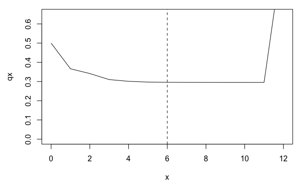

<!-- README.md is generated from README.Rmd. Please edit that file -->

# Rage 

| Project                                                                                                                                                                                                | Main branch                                                                                                                                                                  | Devel branch                                                                                                                                                                   |
|--------------------------------------------------------------------------------------------------------------------------------------------------------------------------------------------------------|:-----------------------------------------------------------------------------------------------------------------------------------------------------------------------------|:-------------------------------------------------------------------------------------------------------------------------------------------------------------------------------|
| [](https://www.gnu.org/licenses/gpl-3.0.html)                                                                                | [](https://github.com/jonesor/Rage/actions/workflows/main_check.yaml) | [](https://github.com/jonesor/Rage/actions/workflows/devel_build_check.yaml) |
| [](https://www.repostatus.org/#active) | [](https://travis-ci.org/jonesor/Rage)                                                                    | [](https://travis-ci.org/jonesor/Rage)                                                                     |
|                                                                                                                                                  | [](https://ci.appveyor.com/project/jonesor/Rage)               | [](https://ci.appveyor.com/project/jonesor/Rage)                |
|                                                                                                                                                              | [](https://codecov.io/github/jonesor/Rage?branch=main)                                    |                                                                                                                                                                                |

------------------------------------------------------------------------

Functions for calculating life history metrics from matrix population
models (MPMs).

Includes functions for:

-   deriving life history traits
-   deriving life tables or life table components
-   deriving vital rates
-   perturbation analyses
-   manipulating and transforming MPMs

## Installation

Install the stable release package from CRAN with:

``` r
install.packages("Rage")
```

Install from GitHub with:

``` r
# install.packages("remotes")
remotes::install_github("jonesor/Rage")
```

### Usage

``` r
library(Rage)
```

### Loading an example MPM

The functions in Rage work on MPMs (or components of MPMs), so we’ll
start by loading one of the example MPMs included in the Rage package
(`mpm1`).

``` r
library(Rage)  # load Rage
data(mpm1)     # load data object 'mpm1'

mpm1
#> $matU
#>         seed small medium large dormant
#> seed    0.10  0.00   0.00  0.00    0.00
#> small   0.05  0.12   0.10  0.00    0.00
#> medium  0.00  0.35   0.12  0.23    0.12
#> large   0.00  0.03   0.28  0.52    0.10
#> dormant 0.00  0.00   0.16  0.11    0.17
#> 
#> $matF
#>         seed small medium large dormant
#> seed       0     0   17.9  45.6       0
#> small      0     0    0.0   0.0       0
#> medium     0     0    0.0   0.0       0
#> large      0     0    0.0   0.0       0
#> dormant    0     0    0.0   0.0       0
```

The object `mpm1` is a list containing two elements: the growth/survival
component of the MPM (the **U** matrix), and the sexual reproduction
component (the **F** matrix). We can obtain the full MPM by adding the
two components together (**A** = **U** + **F**).

### Deriving life history traits from an MPM

One of the most common arguments among functions in Rage is `start`,
which is used to specify the stage class that represents the ‘beginning
of life’ for the purposes of calculation. Because the first stage class
in `mpm1` is a ‘seed’ stage, which we might consider
functionally-distinct from the ‘above-ground’ stages, we’ll specify
`start = 2` to set our starting stage class of interest to the ‘small’
stage.

``` r
life_expect(mpm1$matU, start = 2)               # life expectancy
#> Warning: 'life_expect' is deprecated.
#> Use 'life_expect_mean' instead.
#> See help("Deprecated")
#>       mean     var
#> 1 2.509116 14.5045
longevity(mpm1$matU, start = 2, lx_crit = 0.05) # longevity (age at lx = 0.05)
#> [1] 7
mature_age(mpm1$matU, mpm1$matF, start = 2)     # mean age at first reproduction
#>    small 
#> 2.136364
mature_prob(mpm1$matU, mpm1$matF, start = 2)    # prob survival to first repro
#> [1] 0.4318182
```

Some life history traits are independent of the starting stage class, in
which case we don’t need to specify `start`.

``` r
net_repro_rate(mpm1$matU, mpm1$matF)    # net reproductive rate
#> [1] 1.852091
gen_time(mpm1$matU, mpm1$matF)          # generation time
#> [1] 5.394253
```

Other life history traits are calculated from a life table rather than
an MPM, in which case we can first use the `mpm_to_` group of functions
to derive the necessary life table components.

``` r
# first derive age-trajectories of survivorship (lx) and fecundity (mx)
lx <- mpm_to_lx(mpm1$matU, start = 2)
mx <- mpm_to_mx(mpm1$matU, mpm1$matF, start = 2)

# then calculate life history traits
entropy_k(lx)       # Keyfitz' entropy
#> [1] 0.948235
entropy_d(lx, mx)   # Demetrius' entropy
#> [1] -1.358418
shape_surv(lx)      # shape of survival/mortality trajectory
#> [1] -0.02687175
shape_rep(lx)       # shape of fecundity trajectory
#> [1] 0.4029063
```

### Life tables and the quasi-stationary distribution

Some MPMs are parameterized with a stasis loop at the maximum stage
class, which can lead to apparent plateaus in mortality or fertility
trajectories derived using age-from-stage methods. The function
`qsd_converge()` can be used to identify the time it takes for a cohort
to reach the quasi-stationary distribution (QSD). This quantity can then
be used to subset age trajectories of mortality or fertility to periods
earlier than the QSD, so as to avoid artefactual plateaus in mortality
or fertility.

``` r
# derive life table from MPM
lt <- mpm_to_table(mpm1$matU, start = 2)

# calculate time to QSD
(q <- qsd_converge(mpm1$matU, start = 2))
#> [1] 5

# plot mortality trajectory w/ vertical line at time to QSD
par(mar = c(4.5, 4.5, 1, 1))
plot(qx ~ x, data = lt, type = "l", ylim = c(0, 0.65))
abline(v = q, lty = 2)
```

<!-- -->

From the life table derived from `mpm1`, we can see a plateau in the
mortality rate (qx) beginning around age 5. However, this plateau
corresponds to the QSD and is therefore probably an artefact of the
stasis loop rather than a biological reality for the population
represented by `mpm1`.

One approach to accounting for this artefactual plateau in subsequent
life history calculations is to limit our life table to the period prior
to the QSD.

``` r
# calculate the shape of the survival/mortality trajectory
shape_surv(lt$lx)       # based on full lx trajectory
#> [1] -0.02687175
shape_surv(lt$lx[1:q])  # based on lx trajectory prior to the QSD
#> [1] -0.06475154
```

### Standardized vital rates

The transition rates that make up MPMs generally reflect products of two
or more vital rates (sometimes called ‘lower-level vital rates’).
Assuming a post-breeding census design, we can retroactively break apart
each transition rate into at least two vital rate components: survival,
and ‘something’ conditional on survival. That ‘something’ might be
growth, shrinkage, stasis, dormancy, fecundity, or clonality.

##### Stage-specific vital rates (vector)

To summarize vital rates *within* stage classes, we can use the
`vr_vec_` group of functions. We’ll use the `exclude` argument here to
exclude certain stage classes (‘seed’ and ‘dormant’) from the
calculation of certain vital rates (e.g. we don’t consider the
large-to-dormant transition to actually represent ‘growth’).

``` r
vr_vec_survival(mpm1$matU)
#>    seed   small  medium   large dormant 
#>    0.15    0.50    0.66    0.86    0.39
vr_vec_growth(mpm1$matU, exclude = c(1, 5))
#>      seed     small    medium     large   dormant 
#>        NA 0.7600000 0.4242424        NA        NA
vr_vec_shrinkage(mpm1$matU, exclude = 5)
#>      seed     small    medium     large   dormant 
#>        NA        NA 0.1515152 0.2674419        NA
vr_vec_stasis(mpm1$matU)
#>      seed     small    medium     large   dormant 
#> 0.6666667 0.2400000 0.1818182 0.6046512 0.4358974
vr_vec_dorm_enter(mpm1$matU, dorm_stages = 5)
#>      seed     small    medium     large   dormant 
#>        NA        NA 0.2424242 0.1279070        NA
vr_vec_dorm_exit(mpm1$matU, dorm_stages = 5)
#>      seed     small    medium     large   dormant 
#>        NA        NA        NA        NA 0.5641026
vr_vec_reproduction(mpm1$matU, mpm1$matF)
#>     seed    small   medium    large  dormant 
#>       NA       NA 27.12121 53.02326       NA
```

##### MPM-specific vital rates (scalar)

To summarize vital rates *across* stage classes, we can use the `vr_`
group of functions. By default these functions take a simple average of
the stage-specific vital rates produced by the corresponding `vr_vec_`
function. However, here we’ll demonstrate how to specify a *weighted*
average across stages, based on the stable stage distribution at
equilibrium (*w*).

``` r
# derive full MPM (matA)
mpm1$matA <- mpm1$matU + mpm1$matF

# calculate stable stage distribution at equilibrium using popbio::stable.stage
library(popbio)
w <- popbio::stable.stage(mpm1$matA)

# calculate MPM-specific vital rates
vr_survival(mpm1$matU, exclude_col = c(1, 5), weights_col = w)
#> [1] 0.5963649
vr_growth(mpm1$matU, exclude = c(1, 5), weights_col = w)
#> [1] 0.6602975
vr_shrinkage(mpm1$matU, exclude = c(1, 5), weights_col = w)
#> [1] 0.1960601
vr_stasis(mpm1$matU, exclude = c(1, 5), weights_col = w)
#> [1] 0.2824323
vr_dorm_enter(mpm1$matU, dorm_stages = 5, weights_col = w)
#> [1] 0.1984209
vr_dorm_exit(mpm1$matU, dorm_stages = 5, weights_col = w)
#> [1] 0.5641026
vr_fecundity(mpm1$matU, mpm1$matF, weights_col = w)
#> [1] 37.07409
```

Note how we’ve chosen to exclude the ‘seed’ and ‘dormant’ stage classes
from our vital rate summaries, because we consider these to be special
classes (e.g. ‘growth’ from the ‘seed’ stage is really ‘germination’,
which we may think of as separate from somatic growth from ‘small’ to
‘medium’, or ‘medium’ to ‘large’).

### Perturbation analyses

The `perturb_matrix()` function measures the response of a demographic
statistic to perturbation of individual matrix elements
(i.e. sensitivities and elasticities). The `perturb_vr()` and
`perturb_trans()` functions implement perturbation analyses by vital
rate type (survival, growth, etc.) and transition type (stasis,
retrogression, etc.), respectively.

``` r
# matrix element perturbation
perturb_matrix(mpm1$matA, type = "sensitivity")
#>               seed      small      medium       large     dormant
#> seed     0.2173031 0.01133203 0.004786307 0.002986834 0.001150702
#> small    4.4374613 0.23140857 0.097739871 0.060993321 0.023498190
#> medium  10.8654599 0.56661979 0.239323187 0.149346517 0.057537004
#> large   21.3053309 1.11104269 0.469270739 0.292842888 0.112820081
#> dormant  3.6111989 0.18831948 0.079540420 0.049636196 0.019122780

# vital rate perturbation
# (we use as.data.frame here for prettier printing)
as.data.frame(perturb_vr(mpm1$matU, mpm1$matF, type = "sensitivity"))
#>   survival   growth  shrinkage  fecundity clonality
#> 1 2.986054 1.077597 -0.1653284 0.00572764         0

# transition type perturbation
as.data.frame(perturb_trans(mpm1$matU, mpm1$matF, type = "sensitivity"))
#>     stasis     retro    progr   fecundity clonality
#> 1 1.000001 0.4174435 6.713571 0.007773141        NA
```

### Transforming MPMs

Rage includes a variety of functions that can be used to manipulate or
transform MPMs. For example, we can collapse an MPM to a smaller number
of stage classes using `mpm_collapse()`.

``` r
# collapse 'small', 'medium', and 'large' stages into single stage class
col1 <- mpm_collapse(mpm1$matU, mpm1$matF, collapse = list(1, 2:4, 5))
col1$matA
#>      [,1]        [,2] [,3]
#> [1,] 0.10 11.61331815 0.00
#> [2,] 0.05  0.53908409 0.22
#> [3,] 0.00  0.05728085 0.17
```

The transition rates in the collapsed matrix are a weighted average of
the transition rates from the relevant stages of the original matrix,
weighted by the stable distribution at equilibrium. This process
guarantees that the collapsed MPM will retain the same population growth
rate as the original. However, other demographic and life history
characteristics will not necessarily be preserved.

``` r
# compare population growth rate of original and collapsed MPM (preserved)
popbio::lambda(mpm1$matA)
#> [1] 1.121037
popbio::lambda(col1$matA)
#> [1] 1.121037

# compare net reproductive rate of original and collapsed MPM (not preserved)
net_repro_rate(mpm1$matU, mpm1$matF)
#> [1] 1.852091
net_repro_rate(col1$matU, col1$matF)
#> [1] 1.447468
```

For a complete list of functions see the package
[Reference](https://jonesor.github.io/Rage/reference/index.html) page.

## Previous releases

Specific earlier releases of this package can be installed using the
appropriate `@` tag.

For example to install version 0.1.0:

``` r
remotes::install_github("jonesor/Rage@v0.1.0")
```

See the Changelog for more details.

## Citation

Jones, Owen R., Patrick Barks, Iain M. Stott, Tamora D. James, Sam C.
Levin, William K. Petry, Pol Capdevila, et al. 2021. “Rcompadre and Rage
– Two R Packages to Facilitate the Use of the COMPADRE and COMADRE
Databases and Calculation of Life History Traits from Matrix Population
Models.” *bioRxiv*. doi:
[10.1101/2021.04.26.441330](https://doi.org/10.1101/2021.04.26.441330).

## Contributions

All contributions are welcome. Please note that this project is released
with a [Contributor Code of
Conduct](https://contributor-covenant.org/version/2/0/CODE_OF_CONDUCT.html).
By participating in this project you agree to abide by its terms.

There are numerous ways of contributing.

1.  You can submit bug reports, suggestions etc. by [opening an
    issue](https://github.com/jonesor/Rage/issues).

2.  You can copy or fork the repository, make your own code edits and
    then send us a pull request. [Here’s how to do
    that](https://jarv.is/notes/how-to-pull-request-fork-github/).

3.  You can get to know us and join as a collaborator on the main
    repository.

4.  You are also welcome to email us.
